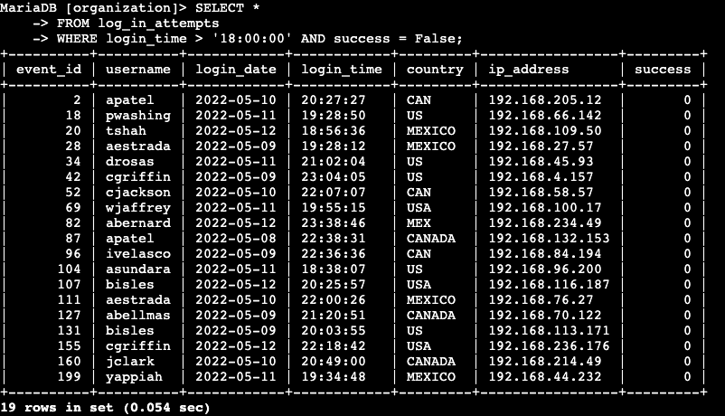
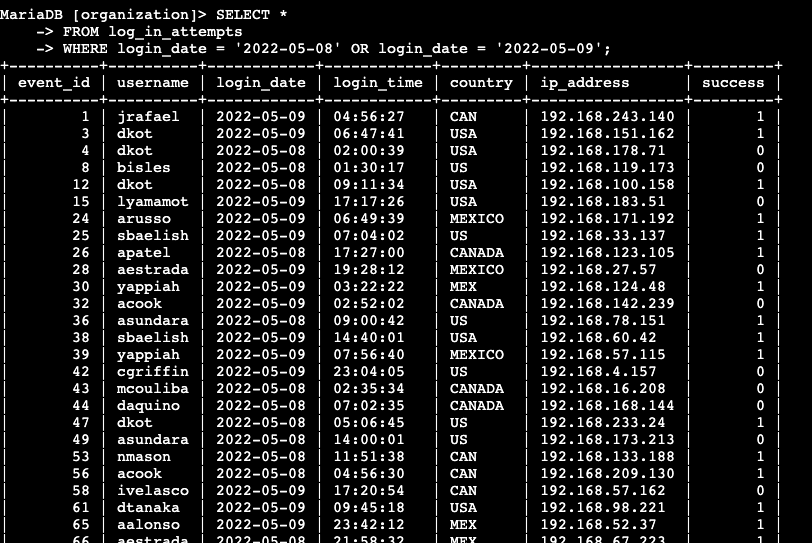
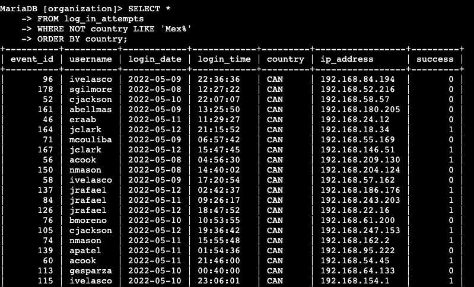
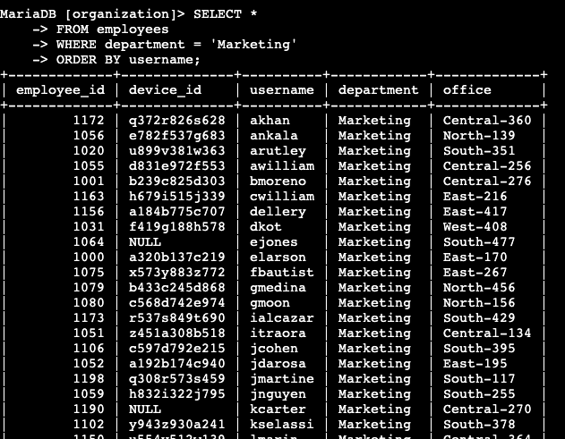
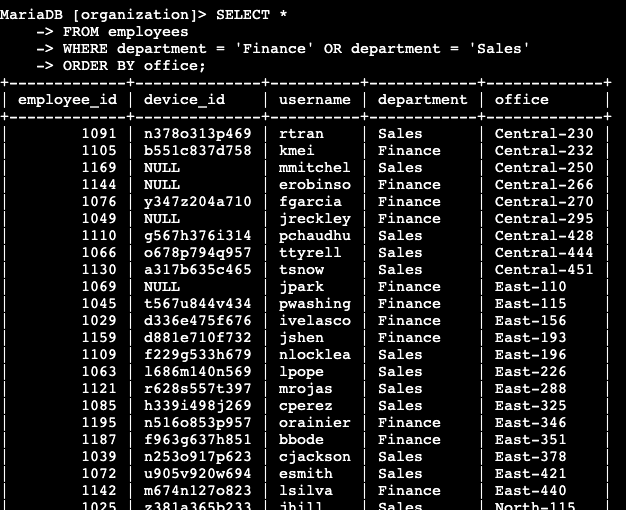
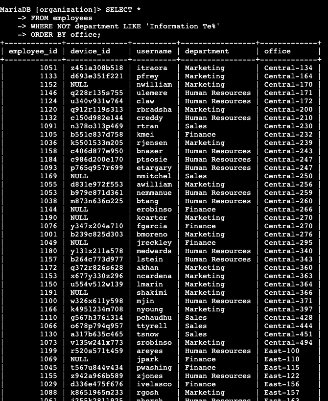

# Apply Filters to SQL Queries
## Scenario
You are a security professional at a large organization. Part of your job is to investigate security issues to help keep the system secure. You recently discovered some potential security issues that involve login attempts and employee machines.

Your task is to examine the organization’s data in their employees and log_in_attempts tables. You’ll need to use SQL filters to retrieve records from different datasets and investigate the potential security issues.
<details>
<summary>Database Details</summary>

### log_in_attempts table
    - `event_id`: The identification number assigned to each login event
    - `username`: username of employee
    - `login_date`: date the login attempt was recorded
    - `login_time`: time the login attempt was recorded
    - `country`: counrty where login attempt occured
    - `ip_address`: IP address of emplyees machine
    - `success`: success metric of the login attempt; FALSE indicates a failed attempt
### employees table
    - `employee_id`: identification number assigned to each employee
    - `device_id`: identification number assigned to each device used by employee
    - `username`: username of employee
    - `department`: department of employee
    - `office`: location of the office 

</details>

## Retrieve after hours failed login attempts
```
SELECT *
FROM log_in_attempts
WHERE login_time > '18:00:00' AND success = False;
```



## Retrieve login attempts on specific dates
```
SELECT * 
FROM log_in_attempts
WHERE login_date = '2022-05-08' OR login_date = '2022-05-09';
```


## Retreive login attempts outside of Mexico
```
SELECT *
FROM log_in_attempts
WHERE NOT country LIKE 'Mex%'
ORDER BY country;
```

## Retreive employees in Marketing
```
SELECT *
FROM employees
WHERE department = 'Marketing'
ORDER BY username;
```


## Retreive employees in Finance or Sales
```
SELECT *
FROM employees
WHERE department = 'Finance' OR department = 'Sales'
ORDER BY office;
```

## Retreive all employees not in IT
```
SELECT *
FROM employees
WHERE NOT department LIKE 'Information Te%'
ORDER BY office;
```


## Summary
I utilized very basic commands to sort database information in order to obtain more contextualized and focused data that would assist in backing up conclusions drawn from various security incidents.  